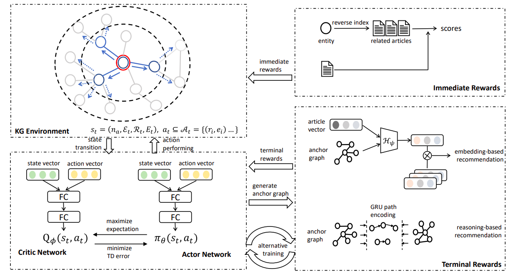

# Reinforced Anchor Knowledge Graph Generation for News Recommendation Reasoning

This repository contains the source code of the paper: Reinforced Anchor Knowledge Graph Generation for News Recommendation Reasoning

## Dataset:

The original data we used is from the public news dataset : [MIND](https://msnews.github.io).

We ...

####Files in data folder:

 

## Requeirements:

python = 3.6 
Pytorch = 1.4.0 
scikit-learn = 0.23.2 
numpy = 1.16.2 
hnswlib = 0.4.0 
networkx = 2.5

## How to run the code:

    $ python ./src/main.py 
